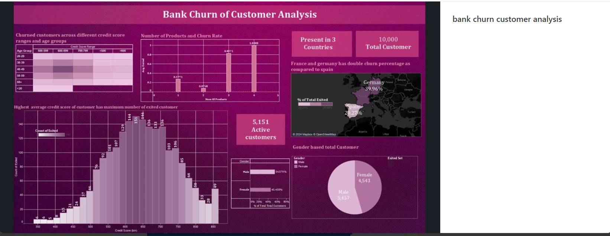

# Bank Customer Churn Analysis

A churn analysis of 10,000 bank customers across 3 countries, exploring which customer segments are most likely to leave and why — visualized in Tableau.

## Key Findings

- **10,000 total customers**, 5,151 currently active, across 3 countries
- **France and Germany show roughly double the churn rate of Spain** — Germany at 39.96% of total exited customers vs. Spain at 20.27%
- **Customers with 4 products have the highest average exit rate** (near 1.0), while customers with 1–2 products churn far less — suggesting over-selling products may correlate with dissatisfaction or account complexity
- **Higher average credit score customers show the highest count of exits**, peaking in the 600–700 credit score range — counterintuitive, since lower-risk customers might be expected to stay
- Churn is fairly evenly split by gender (Female 45.4% vs. Male 54.6% churn share)

## Screenshot

## Tech Stack

Tableau · (originally modeled in Python using Decision Tree, Random Forest, XGBoost, and Gradient Boost classifiers, evaluated on accuracy, precision, recall, and F1-score)

## Note

This project was originally built as a Python machine learning classification task, then re-visualized in Tableau to practice translating model output into a business-facing dashboard. The original notebook isn't available for this repo — this folder showcases the Tableau visualization layer.
