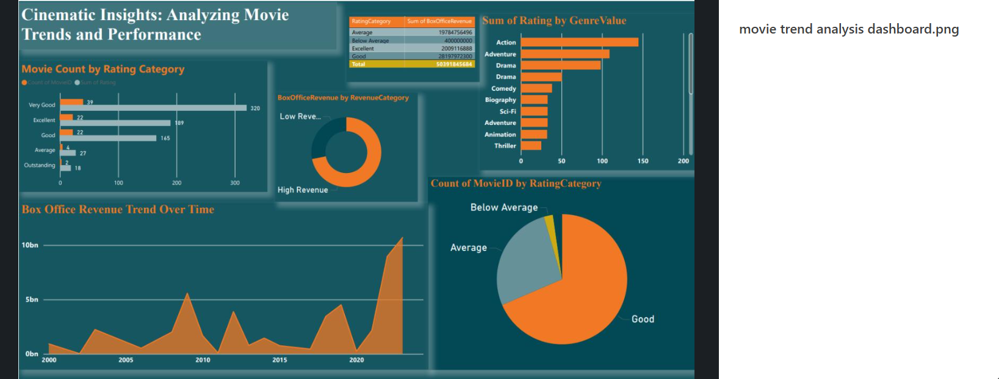

# Cinematic Insights: Movie Trends & Performance Dashboard

A Power BI dashboard analyzing box office revenue trends, genre performance, and audience ratings across movies, built to explore what drives box office success.

## Key Highlights

- **Box Office Revenue Trends** — revenue growth patterns across different time periods (2000–2024)
- **Genre Performance** — how different genres perform in ratings and box office success (Action and Adventure lead in average rating sums)
- **Audience Ratings** — correlation between genre and rating category (Good, Average, Excellent, Very Good, Outstanding)
- **Revenue Segmentation** — movies split into High and Low revenue categories to identify what separates box office hits from underperformers

## Screenshot

## Tech Stack

Power BI

## Use Case

Built as a tool that's useful both for movie enthusiasts exploring trends and for industry professionals looking to spot patterns and make data-driven decisions about genre and release strategy.
