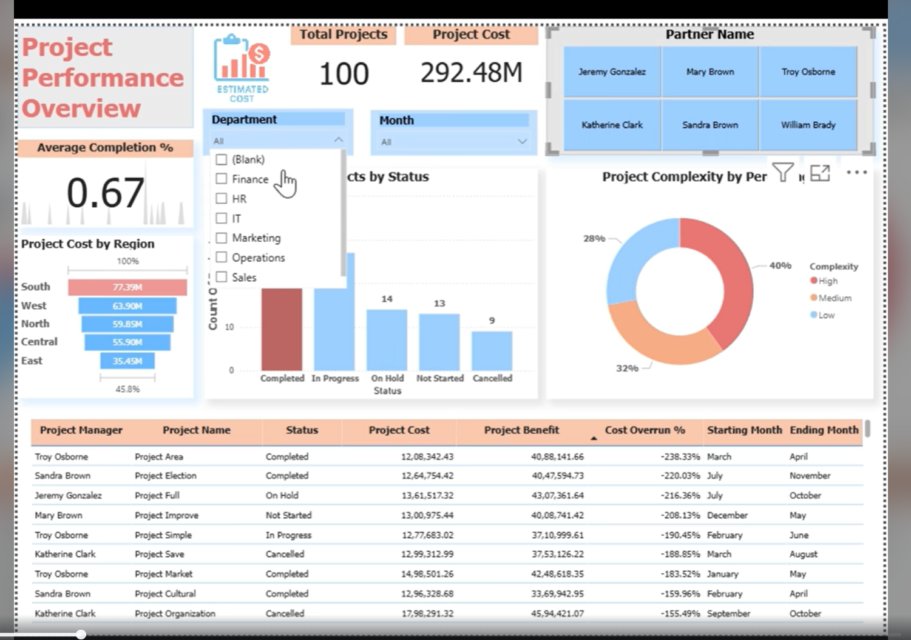
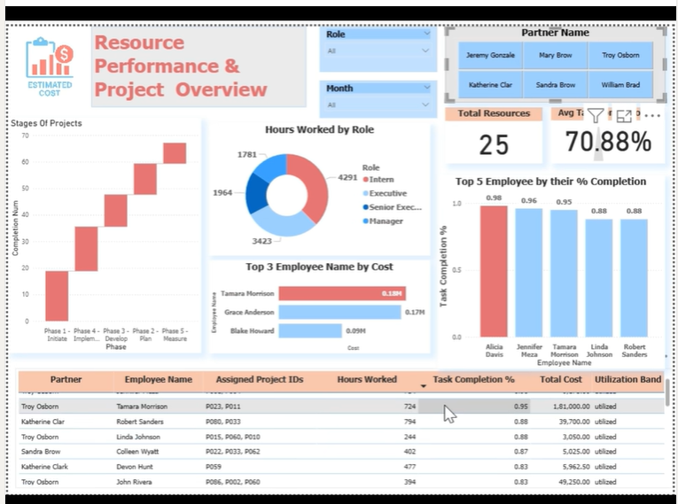

# Project Performance & Employee Utilization Dashboard

A Power BI dashboard recreating the kind of project-tracking reporting used during my internship, rebuilt independently using a Kaggle dataset to keep it fully shareable.

## Idea

*"What if you could track every project and every team member — all in one view?"*

During my internship I worked on similar dashboards, tracking project progress, cost, and employee productivity for audit engagements. This project recreates that experience as a standalone, scalable dashboard built from public data.

## What's Inside

**Project Overview**
- Real-time status breakdown (Completed, On Hold, In Progress, Not Started, Cancelled)
- Project complexity analysis (High / Medium / Low)
- Cost vs. Benefit, with Cost Overrun % by project
- Completion trends and top-cost projects by region

**Employee Performance View**
- Task completion % by employee
- Role-wise hours worked (Intern, Senior Executive, etc.)
- Estimated labor cost using custom DAX
- Utilization tagging (Overutilized / Underutilized)

**Smart Interactivity**
- Filters by Partner, Employee, Region, and Month
- Drilldowns and KPI cards for instant metrics

## Custom DAX Measures

- Dynamic Estimated Cost
- Task Completion Categorization
- Utilization Band logic
- Cost Overrun %

## Screenshots

**Page 1 — Project Overview**

**Page 2 — Resource & Employee Overview**

## Tech Stack

Power BI · DAX · Data Modeling

## What's Next

Potential extensions: Python-based forecasting, a financial/profitability view, and a mobile layout for executives.
